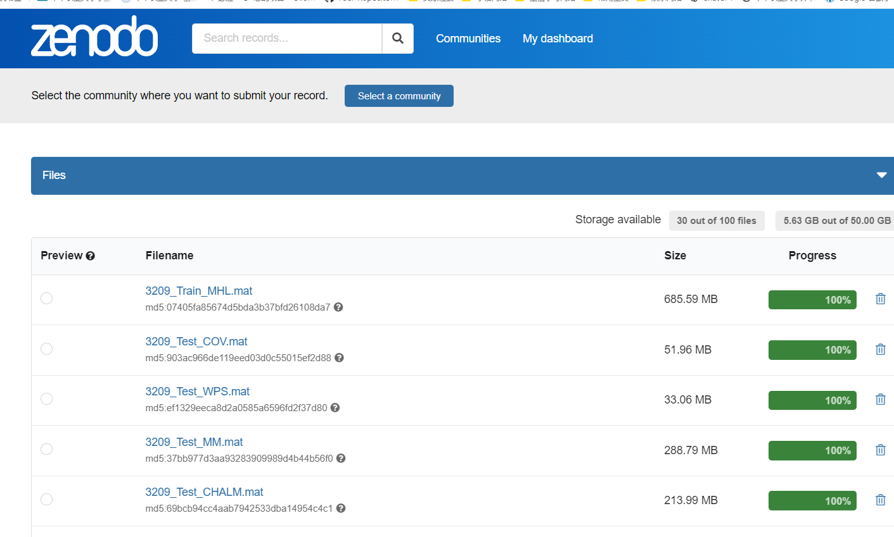

# Methylation_Fragmentomic
if you have any question please contact wangyunze@webmail.hzau.edu.cn 


## Introduction
This repository contains the source code, and package for the paper "Cancer Diagnosis Based on Methylation and Fragmentomic Information from cfDNA Methylation Haplotype Blocks".
This code provides modules for **FAME model construction，the regression of Fragmentomic and Methylation**, as well as modules for **K-fold cross-validation, independent validation and tissue-of-origin inference for cancer classification**.


## Overview of FAME model
<p align="center">
   
</p>


## Table of Contents
 - [Environment](#Environment)
 - [Data_download](#Data)
 - [FAME](#FAME)

<a name="Environment"></a>
## 1 Environment

First, Please install MATLAB
Then, get the code.
```
git clone --recursive https://github.com/alcindor819/FDI_code_MATLAB.git
```

<a name="Environment"></a>
## 2 Data_download
Download all files
```
wget -c https://zenodo.org/record/17697714/
```
<p align="center">
   
</p>

<a name="Data"></a>


## 4 FAME
This module evaluates all cancer tasks in the HRA003209 dataset and generates the figures used in Figure 5 of the manuscript.
For each cancer type, it loads prediction scores, computes model performance, and produces ROC curves, correction heatmaps, cumulative-positive curves, and AUC/Sensitivity barplots.


1. Load Metadata and Configuration

Reads the list of 12 candidate fragmentomic/methylation-based features.

Reads the seven cancer task names.

Loads pre-processed training and test cohort information for 3209 samples.

Defines feature indices (bj) to use for first-layer SVMs.
2. First-Layer Modeling: Single-Modality SVMs

For each selected feature:

Trains a single SVM classifier in a 10-fold cross-validation setting.

Applies trained models to the independent test set.

Saves per-fold ROC information and prediction scores.

Each first-layer SVM produces one probability score per sample.

3. Second-Layer Modeling: Stacking SVM (FAME)

Concatenates the first-layer SVM scores.

Trains a second-layer SVM to obtain the FAME ensemble model.

Computes AUC and sensitivity at 95% specificity for:

Cross-validation (with 95% CI)

Independent validation

4. Visualization

Automatically generates:

ROC curves for CV and IV (one figure per cancer type)

Optional bar charts:

CV AUC with 95% CI

CV Sensitivity@95% specificity with 95% CI

IV AUC (no CI)

IV Sensitivity@95% specificity

All figures are saved under:


First, navigate to the evaluation folder.
```
cd Fig5/Evaluation/
```

Running the main evaluation script:
```
Fig5_RunAllModels
```
The parameters used in the script are listed at the beginning.
Below is a detailed explanation of each parameter and an example setting.

```
task_list_path   = 'your data_path'; 
% Excel file containing the list of cancer types to evaluate.

feature_list_path = 'your data_path'; 
% List of feature names; used for selecting modalities to visualize.

roc_save_root    = 'your data_path'; 
% Folder where ROC curves are saved.

k_data_root      = 'your data_path'; 
v_data_root      = 'your data_path'; 
% Folders containing K-fold (k3209_*.mat) and Validation (v3209_*.mat) model scores.

save_fig_root    = 'your data_path'; 
% Folder for saving heatmaps and cumulative-positive plots.

threshold = -0.75;
% Threshold used in the correction-heatmap.

selected_modalities = [2 8 10];
% The modalities to compare (e.g., WPS, COV, FDI). ENS is always included.

```

After running the script, you will see:
```
k_ROC_XXX.svg
v_ROC_XXX.svg
k_error_heatmap_XXX.svg
v_error_heatmap_XXX.svg
AUC_barplot_CV.svg
AUC_barplot_Validation.svg
Sensitivity_barplot_CV.svg
Sensitivity_barplot_Validation.svg

```


**Fig5_FAME.**
<p align="center">
   
</p>

<a name="FAME"></a>
