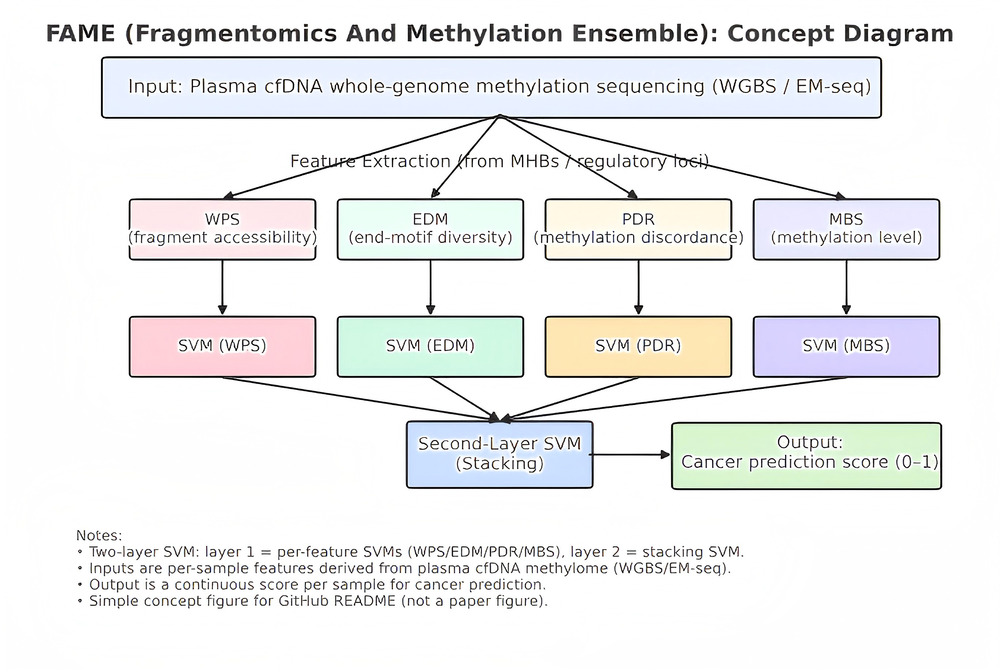

# Methylation_Fragmentomic
if you have any question please contact wangyunze@webmail.hzau.edu.cn and i will reply you


## Introduction
This repository contains the source code, and package for the paper "Cancer Diagnosis Based on Methylation and Fragmentomic Information from cfDNA Methylation Haplotype Blocks".
This code provides modules for **FAME model construction，the regression of Fragmentomic and Methylation**, as well as modules for **K-fold cross-validation, independent validation and tissue-of-origin inference for cancer classification**.


## Overview of FAME model
<p align="center">
   
</p>


## Table of Contents
 - [Environment](#Environment)
 - [Regression work](#Regression)
 - [red and blue](#red)
 - [FAME](#FAME)

<a name="Environment"></a>
## 1 Environment

First, Please install MATLAB
Then, get the code.
```
git clone --recursive https://github.com/alcindor819/FDI_code_MATLAB.git
```

<a name="Preparation"></a>


## 2 Regression

First, move to the folder containing this script.
```
cd Fig2/FragmentomicsToMethylation_R2/
```
Calling the main R² evaluation script:
```
Fig2_FragmentomicsToMethylation_R2()
```


The parameters used in this script are defined at the top of the file and can be modified by the user.
```
PARPOOL_SIZE = 8;                       % Number of workers for parallel computing
DATA_PATH    = '/home/wyz/0Work2/fig2/1/data/'; 
FEATURE_FILE = 'feature_name.mat';      % Contains 12 feature names
OUTPUT_FILE  = 'mean_r2_vs_tree.xlsx';  % Output XLSX file

METH_IDX = 1:7;                         % Methylation feature indices
FRAG_IDX = [10, 12];                    % Selected fragmentomic features
INPUT_IDX_ALL = [METH_IDX, FRAG_IDX];   % Total predictors used (9 features)

TREE_LIST = [5,10,50,100,500,1000,2000,5000,10000];   % Number of boosting trees

MIN_VALID_POINTS = 20;                  % Minimum valid bin count per sample
MIN_STD          = 1e-4;                % Exclude near-constant predictors
```
What the script does

Loads all 12 fragmentomic + methylation feature matrices (2298_featureName.mat)

For each methylation target feature (1–7):

Regress using LSBoost from the 9 candidate predictors

Skip trivial cases where the predictor and target are identical

Compute R² per sample

Aggregate R² across samples and tree numbers

Save results to Excel
After execution, the script produces:
mean_r2_vs_tree.xlsx


**Fig2_regression.**
<p align="center">
   
</p>
<a name="Regression"></a>

## 3 red and blue
This module performs unsupervised clustering on MHB (Methylation Haplotype Block) regions and identifies whether each region is fragmentation-dominant (blue) or methylation-dominant (red).
First, navigate to the MHB clustering folder.
```
cd Fig3/MHB_Clustering/
```

Calling the main clustering script:
```
Fig3_MHB_Clustering_Fragment_vs_Methylation()

```
You can adjust all parameters in the header of the script.
Below are the parameters used inside the script, their meanings, and example settings:
```
DATA_PATH   = 'D:\wyzwork\0工作2\fig2\data\';         % Folder containing feature_name.mat
MHB_PATH    = 'D:\wyzwork\0工作2\fig3\MHB2\';          % Folder containing MHB index files
FEATURE_ROOT = 'E:\下载数据\3209\';                    % Folder containing 3209_Train_feature.mat

NUM_REGIONS = 17611;                                  % Total number of genomic regions
METH_IDX = 1:7;                                        % Indices of methylation features
FRAG_IDX = 8:12;                                       % Indices of fragmentation features
```
containing:
```
dominant_type : 17611 × 1 vector
    1 → fragmentation-dominant (blue region)
    2 → methylation-dominant (red region)
```


**Fig4_red_blue.**
<p align="center">
   
</p>
<a name="red"></a>

## 4 FAME
This module evaluates all cancer tasks in the HRA003209 dataset and generates the figures used in Figure 5 of the manuscript.
For each cancer type, it loads prediction scores, computes model performance, and produces ROC curves, correction heatmaps, cumulative-positive curves, and AUC/Sensitivity barplots.

First, navigate to the evaluation folder.
```
cd Fig5/Evaluation/

```

Running the main evaluation script:
```
Fig5_RunAllModels


```The parameters used in the script are listed at the beginning.
Below is a detailed explanation of each parameter and an example setting.
```
task_list_path   = 'D:\wyzwork\0工作2\fig4\HRA003209\ens_model\canname.xlsx';
% Excel file containing the list of cancer types to evaluate.

feature_list_path = 'D:\wyzwork\0工作2\fig4\HRA003209\ens_model\data_need.xlsx';
% List of feature names; used for selecting modalities to visualize.

roc_save_root    = 'D:\wyzwork\0工作2\fig4\HRA003209\ens_model\zhexian\roc\';
% Folder where ROC curves are saved.

k_data_root      = 'D:\wyzwork\0工作2\fig4\HRA003209\ens_model\zhexian\1\';
v_data_root      = 'D:\wyzwork\0工作2\fig4\HRA003209\ens_model\zhexian\1\';
% Folders containing K-fold (k3209_*.mat) and Validation (v3209_*.mat) model scores.

save_fig_root    = 'D:\wyzwork\0工作2\fig4\HRA003209\ens_model\zhexian\2\';
% Folder for saving heatmaps and cumulative-positive plots.

threshold = -0.75;
% Threshold used in the correction-heatmap.

selected_modalities = [2 8 10];
% The modalities to compare (e.g., WPS, COV, FDI). ENS is always included.

```
After running the script, you will see:
```
k_ROC_XXX.svg
v_ROC_XXX.svg
k_error_heatmap_XXX.svg
v_error_heatmap_XXX.svg
AUC_barplot_CV.svg
AUC_barplot_Validation.svg
Sensitivity_barplot_CV.svg
Sensitivity_barplot_Validation.svg

```


**Fig5_FAME.**
<p align="center">
   
</p>

<a name="FAME"></a>
